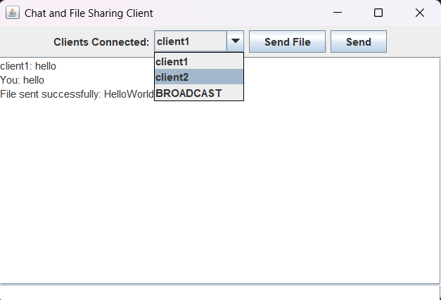
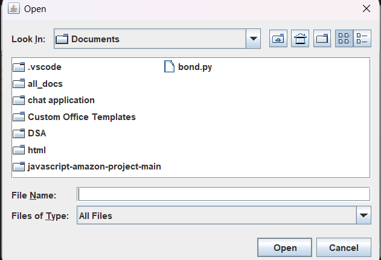

# Java_Chat_application

A **Java-based chat application** that supports multiple clients, one-to-one messaging, message broadcasting, and file sharing. This project is built using **Java Sockets** for networking and **Swing** for the GUI.  

## Features

- **Multi-Client Support:** Multiple clients can connect to the server simultaneously.  
- **One-to-One Messaging:** Send private messages to specific clients.  
- **Message Broadcasting:** Broadcast messages to all connected clients.  
- **File Sharing:** Share files between clients and the server.  
- **User-Friendly GUI:** Built with Java Swing for easy interaction.

## Technologies Used

- **Java SE**  
- **Java Sockets** for networking  
- **Swing** for GUI components

## How to run-
- Download the all class files and java files for chat application.  
- Open command prompt where these files are saved.
- Run the Server-
- javac Server.java
- java Server
- (Server will start running on specified port)
- Run Client-
- javac Client.java
- java Client
- You can run multiple clients at a time

##Screenshots-
1.Client GUI- 
2.All Client Options- 
3.Messaging Passing- 
4.Messaging Broadcast- 
5.File Sharing- 

##Future Improvement-  
- Add user authentication with login and registration.  
- Improve GUI for better user experience.  
- Add notification system for new messages or files.  
